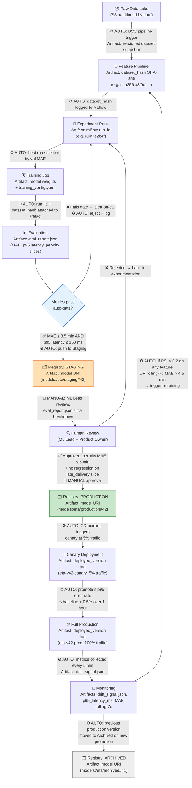

# ETA Model — MLOps Lifecycle

## Artifact Glossary

| Artifact | Format | Where Stored |
|---|---|---|
| `dataset_hash` | SHA-256 string | MLflow params + DVC `.dvc` file |
| `run_id` | UUID (MLflow) | MLflow Tracking Server |
| `training_config.yaml` | YAML | Git commit (pinned to run_id) |
| `eval_report.json` | JSON | MLflow artifacts |
| `model URI` | `models:/eta/<stage>#<version>` | MLflow Model Registry |
| `deployed_version` | Git tag `eta-v{N}-{canary\|prod}` | Git + K8s label |
| `drift_signal.json` | JSON (PSI per feature, rolling MAE) | Monitoring store (EvidentlyAI export) |

## Transition Legend

- **⚙️ AUTO** — triggered by CI/CD pipeline or monitoring hook, no human required  
- **👤 MANUAL** — requires explicit approval in the registry UI or PR review
